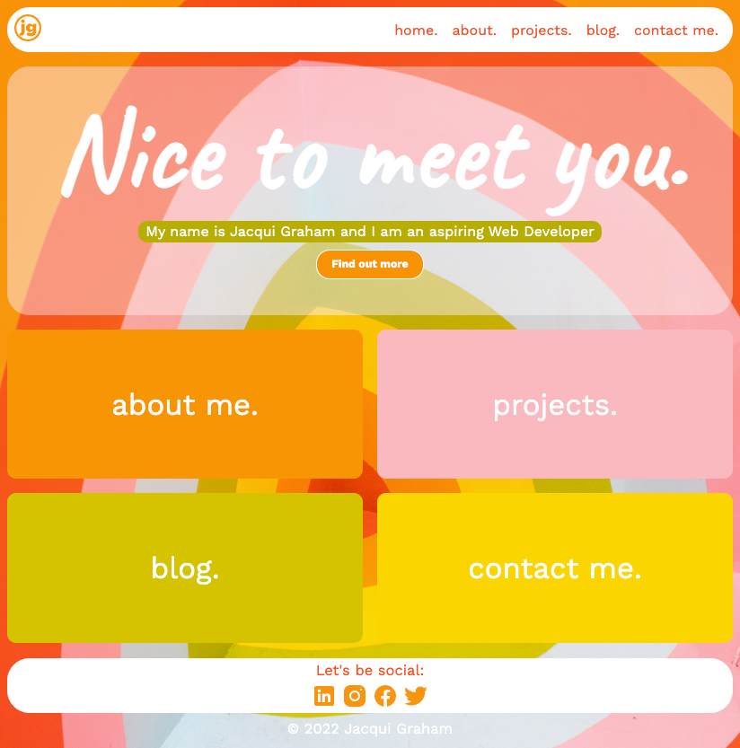
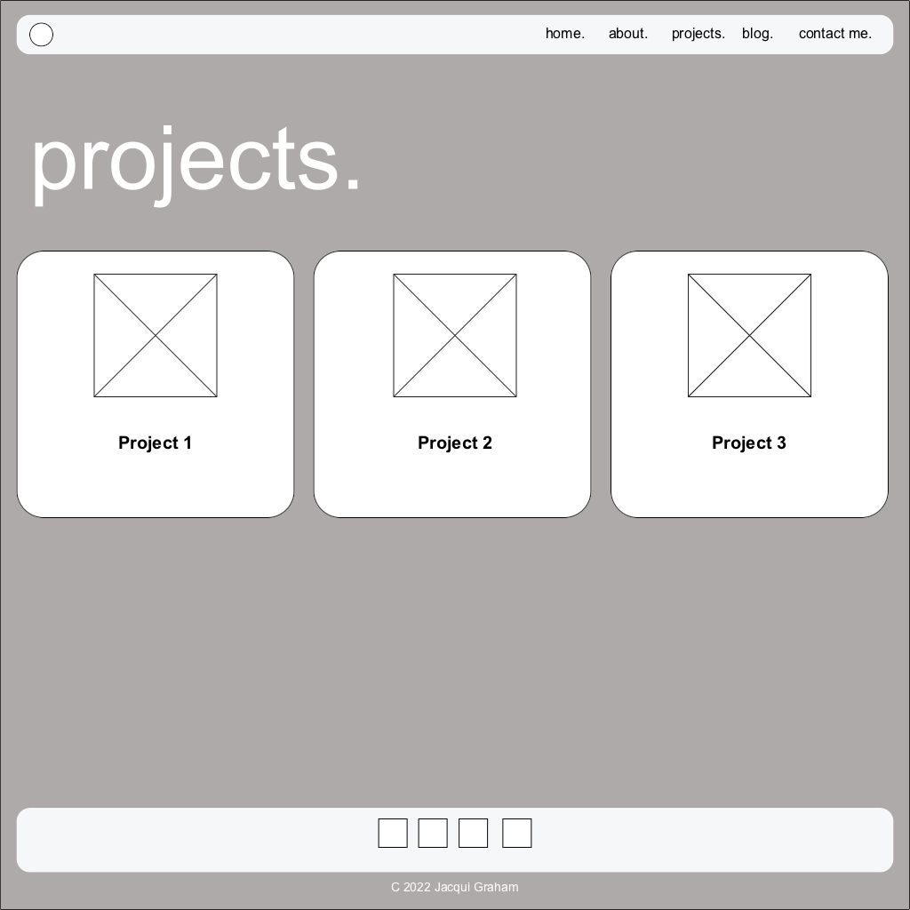
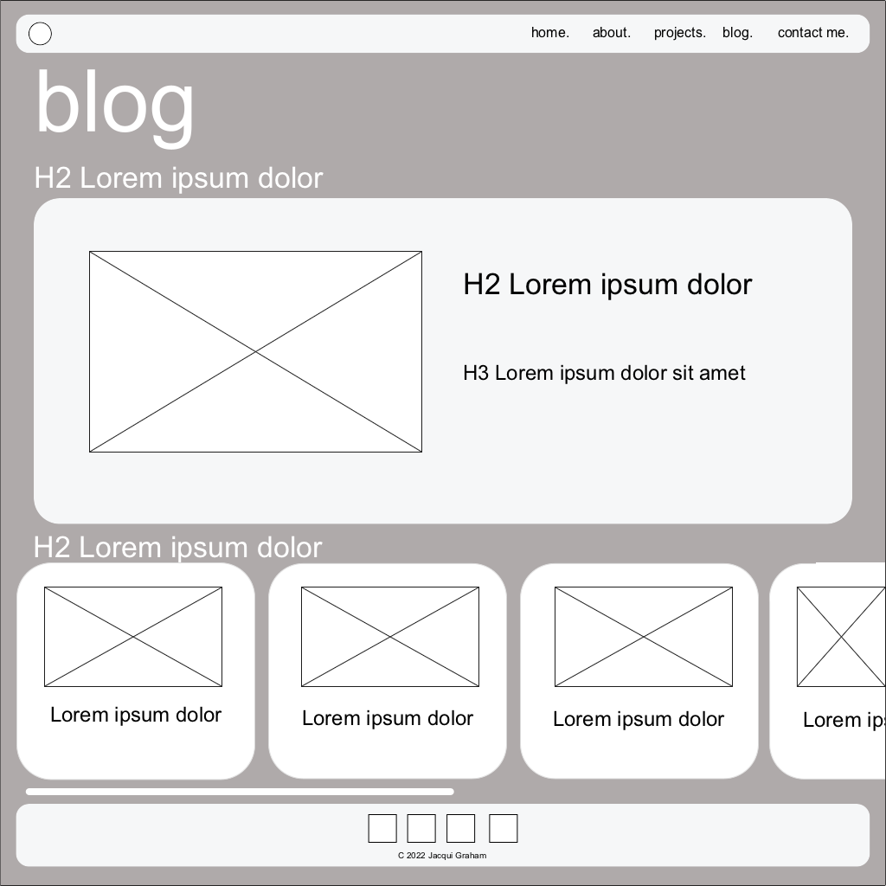

# **T1A2 Portfolio - Jacqui Graham**

### [Portfolio Website](https://cute-tapioca-bd20a2.netlify.app/)

### [GitHub repo](https://github.com/jacmerds/JacquiGraham_T1A2.git)

### [Link to presentation on YT](https://youtu.be/b7d5tOguvWE)

 

## Purpose
This portfolio website showcases my skills and personality that I can showcase to potential future employers. The aim of this portfolio is to allow the audience a snapshit of my personality and style, while showing the skills I have in building a functional and clean website. It will be regulaarly updated as I complete projects while at Coder Academy.

 

## Functionality and features

I wanted to create a bright and happy website that also had a simple and clean design. Having an eyecatching design that functions easily for all users will result in a successful and engaging website.

The website has five main pages, with 5 individual blog posts, accessible by the blog page. The main top navigation including the logo as well as the footer with social link and copyright appear on all pages to maintain the common theme throughout. This will make it easy for the end user as they know exactly where to go to find what they need. The logo in the navigation bar is also a link to the homepage, to align with how most websites function, so the user will be expecting this feature to work the same way. To make the site accessible for all users, there is also a 'home' link in the main navigation.

The colour scheme used for the text and background of certain elements are taken from the website background image. The use of these colours will ensure a sound style throught the website, as well as minimising the possibility of clashing colours thus making it unpleasant to view and use.

This website is responsive at various mobile, tablet and desktop screen sizes to make it accessible to all users. Users are able to see different layouts at certain screen sizes which makes the website even more engaging as they will intentionally view it on all screen sizes.

**Home**: The home page is where I wanted to create a warm welcome for the user. The fade in of the main text adds a fun element that will engage users. Large links in the main area highlight what they can find on this website.

**About**: This shows some personal information so the user and potential employers can learn more. This also has links to my Resume and GitHub.

**Projects**: This shows projects that I will add once I have ompleted them through out my studies.

**Blog**: The blog home page shows the latest blog as a feature, with a horixontal scrollbar of other posts. The use of the smaller images and scrollbar adhere to the intended simple and clean layout that was planned. Each blog title links to that individual page. Once on the blog post, users see the entire content of the blog and a button at the end of the post will take them back to the main blog home.

**Contact**: This includes my direct contact details, and a contact form so users can easily send a message or get in contact with me.

 

## Sitemap
Created using Diagrams.net 

 

## Wireframes and screenshots

### HOME

### ABOUT

### PROJECTS

### BLOG HOME

### INDIVIDUAL BLOG POST

 

## Target audience
The target audience for this website is potential employers and fellow web developers. This website showcases my skills and style, both things that the target audience would be looking at to employ or work with in the future.
 

## Tech stack (e.g. html, css, deployment platform, etc)

The wireframes for the site design were made with Justinmind. This website was built using html and css. It was uploaded to a GitHub repository and deployed using Netlify.

